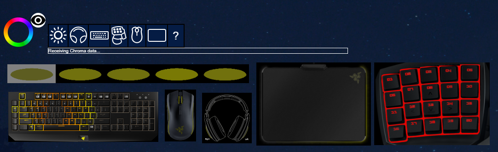

# ChromaClientForMixer
Broadcast Chroma lighting from a Mixer game client

## Table of Contents

* [See Also](#see-also)
* [Releases](#releases)
* [Dependencies](#dependencies)
* [Overview](#overview)
* [Frequently Asked Questions (FAQ)](#faq)

## See Also

**Docs:**

- [Chroma Animation Guide](http://chroma.razer.com/ChromaGuide/) - Visual examples of the Chroma Animation API methods

**Apps:**

- [ChromaClientForDiscord](https://github.com/tgraupmann/ChromaDiscordApp) - Add Chroma lighting to the Discord App events

- [ChromaClientForMixer](https://github.com/tgraupmann/ChromaClientForMixer) - Add Chroma lighting to the Mixer streaming experience

- [ChromaClientForTwitch](https://github.com/tgraupmann/ChromaTwitchExtension) - Add Chroma lighting to the Twitch streaming experience

**Plugins:**

- [CChromaEditor](https://github.com/RazerOfficial/CChromaEditor) - C++ native MFC library for playing and editing Chroma animations

- [GameMakerChromaExtension](https://github.com/RazerOfficial/GameMakerChromaExtension) - GameMaker extension to control lighting for Razer Chroma

- [HTML5ChromaSDK](https://github.com/RazerOfficial/HTML5ChromaSDK) - JavaScript library for playing Chroma animations

- [UE4_XDK_SampleApp](https://github.com/razerofficial/UE4_XDK_SampleApp) - UE4 Chroma samples and runtime module with Blueprint library for the ChromaSDK

- [UnityNativeChromaSDK](https://github.com/RazerOfficial/UnityNativeChromaSDK) - Unity native library for the ChromaSDK

## Releases

* [Chroma Client for Mixer Installer](https://github.com/tgraupmann/ChromaClientForMixer/releases) for Windows

## Dependencies

* [Razer Synapse 3](https://www.razer.com/synapse-3) should be installed and logged in.

* The `Chroma Connect module` within [Synapse](https://www.razer.com/synapse-3) should be installed.

## Overview

The `Mixer` game client broadcasts Chroma lighting for viewers of your live stream. The game client also displays an interactive Chroma widget in your live stream.

<table border="4"><tr><td>

**Quick Note**

* Only the streamer needs to run the `Chroma Client for Mixer` application.

* The viewer just needs to install Synapse and the Connect module within Synapse to see Chroma on the `viewers` hardware.

* The streamer may need to run the application as `Administrator` if a device doesn't broadcast its `Chroma` lighting.

</td></tr></table>

**Video: [Chroma Client for Mixer Setup 0.1.5](https://www.youtube.com/watch?v=C_F707rHlO4)**

<table border="4" bordercolor="red"><tr><td>

</td></tr></table>

**Video: [Client for Mixer Update 0.1.1](https://www.youtube.com/watch?v=5FDDv0XqjrM)**

<table border="4" bordercolor="red"><tr><td>

</td></tr></table>

**Installer**

First install the `ChromaClientForMixer` found in the [Releases](#releases) section.

The installer creates an application shortcut on the desktop.

**Application**

Launch the `Chroma Game Client for Mixer`.

Click the `Authorize Mixer` button to allow the game client to broadcast to `Mixer`.

The `APPROVE` button will authorize the game client.

You can verify or remove the authorization in your `Mixer` account settings in the `OAUTH APPS` tab.

When the `Broadcast on Mixer` checkbox is checked, Chroma will broadcast to `Mixer`. The checkbox can be checked at any time. Broadcast is intended to be enabled simultaneously with other software like `OBS`.

**Custom Widgets**

* The `Chroma` circle is a draggable widget that can be placed anywhere on top of the live video.

* The `eye` will toggle visibility for the virtual `Chroma` device toggles.

* Each `Chroma` device is draggable and resizable.

* Hold `shift` while resizing to maintain aspect ratio.

## FAQ ##

* What if broadcast is on, but viewers aren't seeing lighting data?

1. Make sure [Synapse](https://www.razer.com/synapse-3) is installed and logged in.

2. Connect a Chroma-enabled device.

3. [Synapse](https://www.razer.com/synapse-3) will show an update and install the drivers for the device.

4. Make sure the [Synapse](https://www.razer.com/synapse-3) Connect Module is installed.

5. Viewers should have `Chroma REST API Client for Mixer` at the top of the `Synapse Connect App List`. This will ensure that `Mixer` has the `Chroma` focus above any other `Chroma` apps that might be running at the same time.

* What if the viewer isn't seeing Chroma lighting?

1. Check that the REST API is responding. https://chromasdk.io:54236/razer/chromasdk

2. Make sure the Razer Chroma SDK Server and Service are running.

3. If the `Razer Chroma SDK Server or Service` can't be started then stop both and try to start again. Try a reboot.

4. If there's still an issue, reinstall the Chroma Connect Module in [Synapse](https://www.razer.com/synapse-3).

5. The REST API should work and refresh the Mixer channel to see Chroma lighting.
